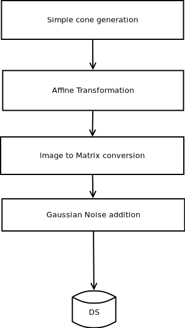

# Synthetic cone generation

The purpose of this project is to build a tool that is capable to produce a synthetic
dataset for detecting cones.

## The pipeline

To simplify and split the work, we have designed this pipeline.
Note: **each stage can be configured with parameters**.

## Stages parameters

- Simple cone generation
  - **size** in terms of height and radius
  - **image_size** in pixel
  
- Affine transformation

  *This stage is created to rotate the cone in all possible ways.*

  - **X** rotation in radians
  - **Y** rotation in radians
  - **Z** rotation in radians

- Image to Matrix Conversion

  *Due to Lidar and Stereo Camera sensor output format, we need to convert the image in a 2D matrix, which each element is \in [0, 255].*

  - no parameters?

- Gaussian Noise addition

  - avg and std_dev

